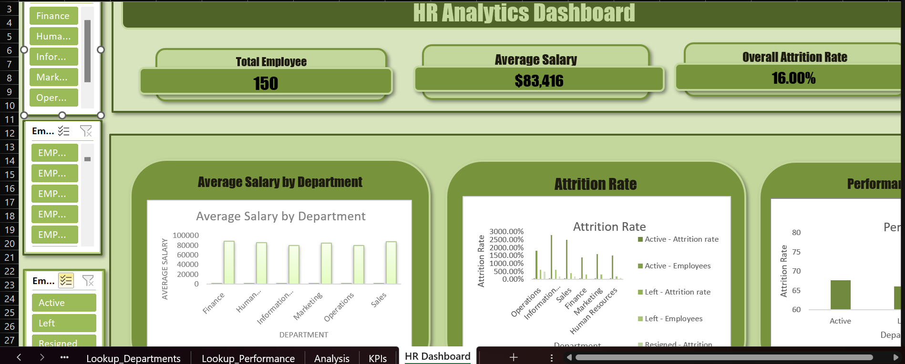

# HR-Analytics-Capstone.
Cleaned and analyzed a messy HR dataset using Excel: data cleaning, VLOOKUP/DATEDIF formulas, Pivot Tables, and an interactive dashboard with slicers to track headcount, salary, attrition, and bonus payouts.
# HR Analytics Capstone - Data Cleaning & Analysis Documentation

## 1. Initial Data Exploration

When I first opened the raw export (Raw_Employee_Data, 158 rows), it was clear the data came straight from a legacy system with no cleanup applied. Some of the main issues I noticed right away:

- Duplicate records. A few Employee IDs (EMP057, EMP017, EMP132, EMP099, EMP076) showed up more than once with identical info.
- Dept Code had inconsistent spacing and capitalization, for example "IT02", " IT02 ", and "it02" all referring to the same department.
- Employment Status had the same problem, plus a spelling inconsistency: "Active", "ACTIVE", " ACTIVE ", "Actv", and "active" were all meant to be the same status.
- Hire Date was stored in three different formats: Excel serial numbers (like 43093), text dates like "02-Mar-20", and text dates like "09/24/2019".
- Salary was a mix of plain numbers (50361) and text values with dollar signs and commas ("$114,425").
- A few rows were missing First_Name or Perf_Score.

Two lookup tables were provided to help clean and enrich the data: Lookup_Departments (department code to full name) and Lookup_Performance (score range to performance band and bonus percentage).

## 2. Cleaning Process and Order

I worked through the sheet in this order, using temporary helper columns for each fix so I could check the results before pasting them back over the original data as values.

1. Removed exact duplicate rows first, using Data > Remove Duplicates with all columns checked. I did this before anything else so I wasn't wasting time cleaning rows that would just get removed anyway.
2. Cleaned Dept Code using TRIM and UPPER to remove extra spaces and force consistent capitalization.
3. Cleaned Employment Status using TRIM and PROPER, then used Find & Replace to fix "Actv" to "Active" since that one was a spelling issue rather than a spacing issue.
4. Cleaned Hire Date using Text to Columns first, then a formula that checked if a cell was already a number and only converted it with DATEVALUE if it was still text. Formatted the whole column as a consistent date format afterward.
5. Cleaned Salary using SUBSTITUTE to strip out dollar signs and commas, then VALUE to turn the result into an actual number.
6. Checked every cleaned Dept Code against Lookup_Departments using a VLOOKUP/ISNA check to make sure every code had a match before moving on. Everything came back OK, so no unmatched codes needed fixing.

## 3. Handling Missing Values

- Missing First_Name: I left these blank rather than filling them in with a placeholder. The rest of each employee's record was still complete and usable, so I didn't think it was necessary to guess a name or delete the row.
- Missing Perf_Score: Also left blank instead of filled in with an average or estimate, since making up a score would have thrown off the Performance Band and Bonus calculations. I built the formulas so blank scores show "No Score" for Performance Band and $0 for Eligible Bonus Amount, instead of guessing.
- A few Salary cells showed #VALUE! errors after cleaning, which happened because those cells were originally blank and there was nothing to convert. I left those blank as well rather than filling in a number.

## 4. New Columns

| Column | Formula Logic | Notes |
|---|---|---|
| Full Name | Combines First and Last name with TRIM | Handles extra spaces if one part is blank |
| Department Name | VLOOKUP against Lookup_Departments | Exact match |
| Years of Service | DATEDIF from Hire Date to today, only for Active employees | See note below |
| Performance Band | VLOOKUP (approximate match) against Lookup_Performance | Blanks show "No Score" |
| Eligible Bonus Amount | Salary multiplied by bonus percentage from Lookup_Performance | Blanks show $0 |

Note on Years of Service: the dataset doesn't include a termination date for employees who left or resigned, so there's no way to know how long they actually worked before leaving. Calculating Hire Date to today for everyone would make it look like former employees are still accumulating tenure right now, which isn't accurate. Because of that, I only calculated Years of Service for Active employees and marked it "N/A" for anyone who left or resigned.

## 5. Pivot Tables

Built four Pivot Tables on a new Analysis sheet:
1. Headcount and average salary by department.
2. Attrition rate by department (Left/Resigned as a percentage of total per department).
3. Average performance score for Active vs. Left/Resigned employees.
4. Total projected bonus payout by performance band.

## 6. Dashboard

Built a separate HR Dashboard sheet with:
- Three KPI cards (Total Employees, Average Salary, Overall Attrition Rate), using formulas that pull from the raw data and pivot tables so they update automatically.
- Column charts built from each of the four Pivot Tables.
- Slicers for Department and Employment Status, connected to the charts through Report Connections so the dashboard updates together.
- 

## 7. Challenges

- Slicer connections kept giving a "reference not valid" error at first. It turned out to be because some Pivot Tables weren't built from the same data range/cache as the others, so the slicer couldn't recognize them as connected. Rebuilding those Pivot Tables from the same source range fixed it.
- Building the dashboard layout itself took some trial and error as i have always found it difficult. I ended up watching a couple of YouTube tutorials on dashboard layout and slicer setup to get a better sense of how to put it together.
